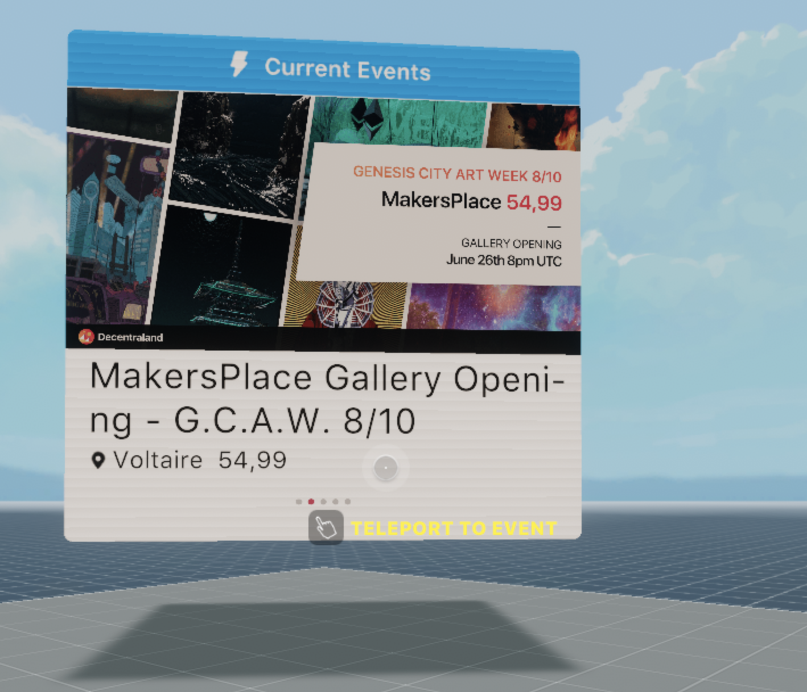

# Events API Board

Call the Decentraland Events API to display events that are currently going on. If there are several active at the same time, it will cycle through up to 5 events.

Events that are currently going on have a `live` field = _true_, so it's easy to filter through the returned events to only pick those that are live.

The board displays the event's title, screenshot, location, and location name (if applicable). The board also works as a teleport when clicked, taking players to the currently displayed event.

## About the events API:

Root URL: https://events.decentraland.org/api/events/

Events are always ordered by their `start_at` time

optional params:

- limit: only show x amount of events
- offset: start showing events from x position onwards
- position: a single event on x position
- estate_id: only events that happen in a given estate
- user: only events created by a given user
- onlyUpcoming: only events that have not started yet
